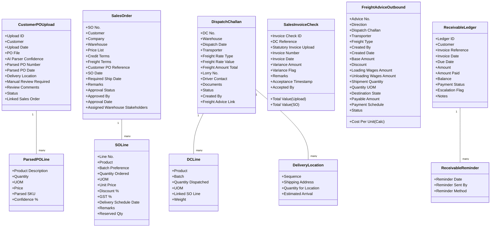

# Zoho Creator ERP Data Model – Field Maps

The diagrams below provide a pictorial overview of every form and field defined in the Zoho Creator ERP data model. Each module
has its own Mermaid `classDiagram`, enabling designers and developers to visualise structures while cross-referencing the
comprehensive field catalogue.

---

## Core & Shared Masters

---

## Purchase Module

---

## Sales Module

---

## Production Module

---

## Quality Control Module

---

## Inventory, Logistics & Returns

```mermaid
classDiagram
    class InventoryLedger {
        +Ledger Entry ID
        +Transaction Date
        +Warehouse
        +Godown
        +Product
        +Batch
        +Quantity In
        +Quantity Out
        +UOM
        +Transaction Type
        +Source Document
        +Cost
        +Status
        +FIFO Layer ID
        +Remarks
    }
    class StockTransferDC {
        +Transfer No.
        +Created Date
        +From Warehouse
        +To Warehouse
        +Dispatch Date
        +Transporter
        +Freight Terms
        +Loading Wages
        +Freight Amount
        +Status
        +Documents
    }
    class StockTransferLine {
        +Product
        +Batch
        +Quantity
        +UOM
        +Source Godown
        +Destination Godown
    }
    class StockTransferReceipt {
        +Receipt No.
        +Receipt Date
        +From Warehouse
        +To Warehouse
        +Linked Transfer
        +Received By
        +QC Result
        +Variance Notes
        +Status
    }
    class StockTransferReceiptLine {
        +Product
        +Batch
        +Quantity Dispatched
        +Quantity Received
        +UOM
        +Received Godown
        +Condition
    }
    class WarehouseShifting {
        +Shifting No.
        +Warehouse
        +Request Date
        +From Godown
        +To Godown
        +Reason Code
        +Other Reason
        +Status
        +In-Transit Flag
        +Attachments
    }
    class ShiftingProduct {
        +Product
        +Batch
        +Quantity
        +UOM
    }
    class ShiftingExpense {
        +Expense Type
        +Vendor
        +Amount
        +Payable By
        +Approval Status
    }
    class JobWorkOrder {
        +Order No.
        +Warehouse
        +Vendor
        +Template
        +Template Revision
        +Start Date
        +Expected Completion Date
        +Turnaround Threshold
        +Freight Terms
        +Status
        +Alerts Enabled
    }
    class JobWorkMaterial {
        +Material Type
        +Product/Machine
        +Batch
        +Quantity
        +UOM
    }
    class JobWorkOutput {
        +Product
        +Expected Quantity
        +UOM
        +Expected Batch Suffix
    }
    class JobWorkDC {
        +JW DC No.
        +Job Work Order
        +Vendor
        +Dispatch Date
        +Transporter
        +Freight Terms
        +Documents
        +Status
    }
    class JobWorkDCMaterial {
        +Material Type
        +Product/Machine
        +Batch
        +Quantity
        +UOM
        +Expected Return Date
    }
    class JobWorkReceipt {
        +Receipt No.
        +Receipt Date
        +Job Work Order
        +JW DC Reference
        +Vendor
        +New Batch ID
        +QC Result
        +Pending Quantity
        +Status
    }
    class JobWorkReturn {
        +Product
        +Batch
        +Quantity Received
        +UOM
        +Viability
    }
    class JobWorkCharge {
        +Charge Type
        +Amount
        +TDS %
        +Payable By
    }
    class SalesReturnAdvice {
        +Return No.
        +Return Date
        +Customer
        +Original Invoice
        +Returned By
        +Received Warehouse
        +Freight Terms
        +QC Requirement
        +Approval Status
        +Remarks
    }
    class SalesReturnLine {
        +Product
        +Batch
        +Quantity Returned
        +UOM
        +Condition
        +Viability Notes
        +Packing Material Captured
    }
    class SalesReturnFreight {
        +Freight Type
        +Transporter
        +Amount
        +Discount
        +Payable By
    }
    class SalesReturnWage {
        +Charge Type
        +Contractor Vendor
        +Amount
        +TDS %
        +Payable By
    }
    class StockAdjustment {
        +Adjustment No.
        +Adjustment Date
        +Warehouse
        +Godown
        +Product
        +Batch
        +Adjustment Type
        +Quantity
        +UOM
        +Reason Code
        +Other Reason
        +Evidence Attachments
        +Value Impact
        +Finance Review Required
        +Approval Status
        +Approved By
        +Approval Date
        +Notified To
        +Notes
    }
    StockTransferDC "1" -- "many" StockTransferLine
    StockTransferReceipt "1" -- "many" StockTransferReceiptLine
    WarehouseShifting "1" -- "many" ShiftingProduct
    WarehouseShifting "1" -- "many" ShiftingExpense
    JobWorkOrder "1" -- "many" JobWorkMaterial
    JobWorkOrder "1" -- "many" JobWorkOutput
    JobWorkDC "1" -- "many" JobWorkDCMaterial
    JobWorkReceipt "1" -- "many" JobWorkReturn
    JobWorkReceipt "1" -- "many" JobWorkCharge
    SalesReturnAdvice "1" -- "many" SalesReturnLine
    SalesReturnAdvice "1" -- "many" SalesReturnFreight
    SalesReturnAdvice "1" -- "many" SalesReturnWage
```

---

## Finance Module

---

## Attendance & HR Module

---

## Configuration & Audit

Use these diagrams alongside the detailed data model tables to validate Creator form design, workflow automation, and reporting
schema coverage.
