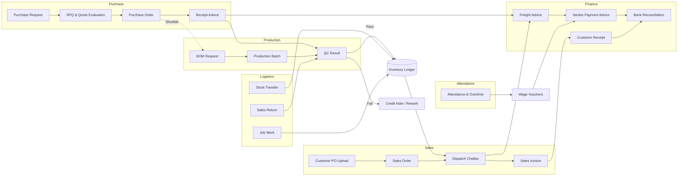
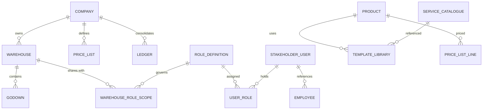
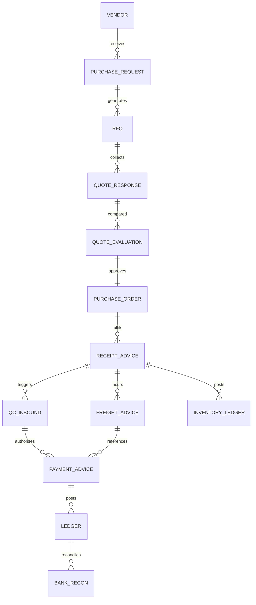
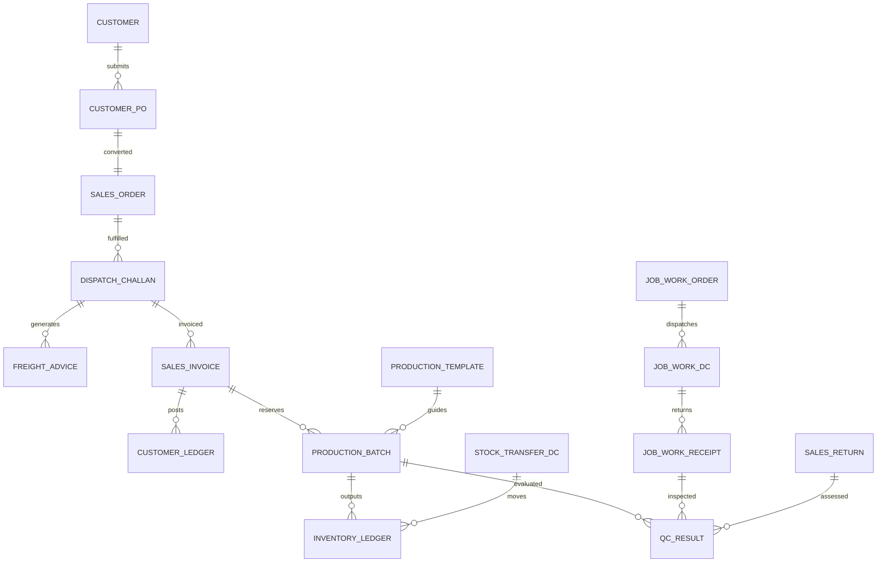

# Zoho Creator ERP Blueprint

## 1. Solution Overview

This blueprint translates the ERP vision into a Zoho Creator application suite that supports multi-company, multi-warehouse operations governed from a Head Office (HO). The design emphasises role-based security, modular workflows, configurable master data, and extensibility for future warehouses, products, and services. The artefact is structured for Creator builders and process owners to collaborate on implementation details, identify dependencies, and phase the rollout.

### Related Documents
- **[ERP Structure & Hierarchy](./zoho_creator_erp_structure.md)** – organisational layers, role responsibilities, and master data governance.
- **[Module Flowcharts](../process/zoho_creator_module_flowcharts.md)** – detailed flow diagrams for each functional area.
- **[Data Models](../data-models/zoho_creator_data_models.md)** – Creator form catalogues with key attributes and relationships.
- **[Domain ERD Library](../data-models/zoho_creator_erds.md)** – conceptual entity-relationship diagrams per module.
- **[Cross-Module ERDs](../data-models/zoho_creator_cross_module_erds.md)** – end-to-end data connections across modules.
- **[Master Forms Guide](../process/zoho_creator_master_forms.md)** – step-by-step instructions for configuring all shared masters.
- **[Phase 1 Zia Form Prompts](../../data/zia_phase1_form_prompts.md)** – Zoho Zia inputs for Procure-to-Pay & inventory transactional forms.
- **[Deluge Form Library](../../forms/ds/)** – per-form `.ds` definitions and companion reports generated directly from the data model, formatted to match the Final_All_Field_Types Creator template (sections, `must have` prefixes, grid subforms, and action blocks).
- **[Form Script Generator](../../scripts/generate_creator_ds_forms.py)** – converts the canonical data model into the `.ds` library.
- **[Phased Implementation Plan](../implementation/zoho_creator_implementation_plan.md)** – rollout roadmap with dependencies and timelines.
- **[Phase 0 – Foundation & Governance Playbook](../implementation/phase0_foundation_governance_plan.md)** – detailed week-by-week setup actions.
- **[Phase 1 – Procure-to-Pay & Inventory Control Playbook](../implementation/phase1_procure_to_pay_inventory_plan.md)** – implementation steps for procurement and inventory.
- **[Setup Script & Repository Structure](../setup/zoho_creator_setup_structure.md)** – scaffolding script usage and source control layout.
- **[Security Model Build Playbook](../governance/zoho_creator_security_model_plan.md)** – sequential procedure for implementing role-based access and record sharing.
- **[Integration Baseline Build Playbook](../governance/zoho_creator_integration_baseline_plan.md)** – step-by-step integration setup for AI services, finance, and banking.
- **[Change Enablement Playbook](../governance/zoho_creator_change_enablement_plan.md)** – communication, training, and adoption plan for rollout.

### 1.1 Design Principles
- **Single tenant, multi-entity**: One Creator application where companies and warehouses are linked to a central Head Office, yet each warehouse works autonomously for stock, production, and attendance.
- **Role-centric security**: Stakeholders act in multiple roles; permissions inherit from role assignments with scoped data sharing rules per warehouse/company.
- **Template-driven operations**: Purchase, Sales, Production, QC, and Job Work leverage configurable templates with revision history (Rev 1, Rev 2, …) and audit trails.
- **Document-first interactions**: Every external transaction captures the source document (PO, invoice, weighment slip) as file uploads tied to structured metadata.
- **Workflow automation**: Approval routing, notifications, escalations, and conditional branching follow Deluge workflow rules.
- **Financial compliance**: GST/TDS/TCS tracking, ledger integrity, bank reconciliation, and lockable fiscal periods follow Indian statutory needs.
- **Extensibility**: IT Admin owns master data maintenance, including products, services, price lists, templates, tax masters, and freight matrices.
- **Multi-device experience**: Key pages are optimised for both desktop (HO back office) and mobile (warehouse floor teams) interfaces within Zoho Creator.

### 1.2 Application Structure
- **App Groups**: Separate Creator pages/workflows by module (Purchase, Sales, Production, QC, Inventory, Finance, Attendance, Logistics).
- **Shared Masters**: Centralised forms (Company, Warehouse, Stakeholder Roles, Products, Services, Vendors, Customers, Transporters, Tax, Freight Terms, Templates, Machines, Employees/Staff).
- **Integrations**: External services include Zoho Sign-in (portal users), AI-powered PO parser (OpenAI API), face recognition (OpenAI API), Tally exports, bank statement parsers.
- **Admin Console**: Custom page for IT Admin to maintain branding (logos/templates), system parameters, service categories, approval delegations, and automation thresholds.

### 1.3 Cross-Module Flowchart
The following flowchart summarises the interactions between major modules from demand capture to financial closure.

## 2. Data Model Catalogue
The following tables are primary Zoho Creator forms (or subforms) with key fields and relationships. All forms include standard metadata: Created By, Created Time, Modified By, Modified Time, Active/Inactive.

### 2.1 Core Masters
| Form | Key Fields | Relationships/Notes |
| --- | --- | --- |
| **Company** | Company Code, Legal Name, GSTIN, Billing Address, Default Currency | Linked to Price Lists, Tax Policies, Financial Ledgers |
| **Warehouse** | Warehouse Code, Name, Company Lookup, Address, Geo Coordinates, Time Zone, Default Currency | Lookup to Warehouse Coordinator (Office) & Warehouse HR Coordinator; Godowns captured via dedicated master |
| **Godown** | Godown Code, Warehouse Lookup, Temperature Range, Capacity, Batch Tracking Flag | Products-in-godown via Inventory Ledger |
| **Role Definition** | Role Code, Role Name, Module Permissions (JSON), Visibility Scope (HO-only, Warehouse-specific), Approval Levels | Associated with Portal Users |
| **User (Stakeholder)** | Portal User, Employee Lookup (optional), Roles (multi-select), Default Warehouse Scope | Sharing rules rely on this mapping |
| **Employee / Staff Master** | Staff ID, Name, Employment Type (Staff/Employee), Designation, Company, Warehouse/Department, Join Date, Photo, Active Flag | Used by Attendance, Wage modules |
| **Product** | SKU Code, Name, Company Scope (multi), Product Type (Goods/Services), Sub-type, Batch Tracking (Yes/No), QC Required By (Warehouse Coordinator / QC Coordinator / QC Manager), Unit of Measure, Alternate UOMs (subform with conversion factors and specific gravity), Packing Material Association, Yield Tracking Flags (Physical Qty, Purity %, AI Content), Wage Calculation Method (Template-based / Headcount-based / None), Service Category (for service-type) | Linked to BOM templates, Price Lists, Inventory, QC templates |
| **Service Catalogue** | Service Code, Name, Category (Warehouse Expense, Wages, Freight, etc.), Direction (Inbound/Outbound/Both), Default TDS/TCS, Warehouse-specific availability | IT Admin can extend |
| **Machine / Equipment** | Machine ID, Warehouse Lookup, Godown Lookup, Machine Type, Maintenance Schedule | Used in Job Work tracking and maintenance planning |
| **Vendor** | Vendor Code, Company, Vendor Type (Goods, Services, Freight, Job Work, Contractor), GSTIN, PAN, Address, Payment Terms (Net Days), Freight Terms (Paid/To_Pay/Mixed), TDS/TCS Rates, Bank Details, Preferred Transporters, Default Currency | Linked to Purchase Orders, Freight Advice, Wages, Job Work |
| **Customer** | Customer Code, Company, GSTIN, Billing/Shipping Addresses, Credit Terms, Freight Terms, Allowed Price Lists (multi-select), Default Warehouse | Linked to Sales Orders, Freight Advice, Receivables |
| **Transporter** | Transporter Code, Name, GSTIN, Contact, Freight Modes (Local Drayage, Linehaul), Usual Routes, TDS %, Payment Terms | Shared between Purchase/Sales logistics |
| **Price List** | Price List ID, Company, Customer Lookup, Validity, Currency, Region/Delivery Location, Active Flag, Subform Lines (Product, Rate, Unit, Taxes) | Multiple active lists allowed; Sales Order picks by delivery location |
| **Tax Master** | Tax Type (GST/TDS/TCS), Rate %, Effective Dates, Applicable To (Products/Services/Freight/Wages), Thresholds | Referenced by transactions |
| **Template Library** | Template Type (Production, QC Report, Job Work, Packing List, Invoice, etc.), Template Name, Warehouse Scope, Revision No, Effective Date, JSON/XML Layout, Status | Admin-editable |

### 2.2 Inventory & Production
| Form | Key Fields | Relationships/Notes |
| --- | --- | --- |
| **Inventory Ledger** | Warehouse, Godown, Product, Batch No (optional), Qty In, Qty Out, UOM, Transaction Type (Receipt Advice, Production Output, Stock Transfer, Adjustment, Job Work Return, Sales Dispatch), Linked Document ID, Cost, Status (Available/In Transit/Reserved) | Supports FIFO costing, batch tracking, godown mapping |
| **Production Template** | Warehouse, Template Name, Revision, Output Products (subform: Product, UOM, Expected Yield %, Purity %, AI Content), Input Products (subform: Product, Qty per Output UOM, Loss %, Packing Material Flags), Wages (Template-based amount), QC Parameters (Lookup to QC Parameter library), Allow Headcount Wage (Yes/No) | Version controlled |
| **Work Order / Production Batch** | Batch ID (system generated), Warehouse, Template Revision, Source Sales Order/DC, Scheduled Start/End, Status (Requested, Approved, In-Process, QC Hold, Rework, Closed), BOM Request (lookup), Actual Inputs (subform with Issue Qty), Actual Outputs (subform with Batch Nos, Qty, Purity, AI Content), Wage Calculation (template vs headcount), QC Result Link, Damage/Return Records, Remarks | HO roles view all; warehouse-limited scope |
| **BOM Request** | Warehouse, Requested By, Template, Output Product & Qty, Auto-calculated Inputs (Qty Available, Qty Required, Shortfall), Approval Status, Excel Export file | Feeds Purchase Requests if shortfall exists |
| **Material Issue** | Warehouse, Work Order, Product, Qty Issued, UOM, Issued By, Approved By, Issue Type (Production, Machine Spares, Packing Material) | Updates inventory |
| **Wage Voucher (Production)** | Work Order, Wage Type (Template/Headcount), Staff/Contractor, Hours/Tasks, Amount, TDS %, Approval Workflow (Warehouse Coordinator at Office → Finance Manager) | Posted to Finance |

### 2.3 Purchase Module
| Form | Key Fields | Notes |
| --- | --- | --- |
| **Purchase Request (PR)** | Warehouse, Godown, Requested By (Manager/Coordinator), Product/Service lines (Qty, Required Date, Purpose, Attachments), Status (Draft, Submitted, Partially Approved, Approved, Rejected), Visibility restricted to warehouse + HO roles | Approval by Warehouse Coordinator at Office / Purchase roles |
| **Quote Request (RFQ)** | PR linkage (single/multiple), Vendor list (subform with vendor-specific specs/attachments), Skip RFQ flag (with Purchase Manager approval), AI attachments, Dispatch ETA updates | Generates Quote Evaluation |
| **Quote Response** | Vendor, RFQ, Price, Qty, Delivery Terms, Freight Terms, Payment Terms, Specification Attachments, Validity, Taxes | Linked to evaluation |
| **Quote Evaluation** | RFQ, Comparative Table (subform), Recommended Vendor, Reason for Non-lowest selection, Approvals (Purchase Coordinator, Purchase Manager), Audit log | Mandatory when RFQ conducted |
| **Purchase Order (PO)** | PO No + Revision, Vendor, Company, Linked PRs/RFQ, Products (Qty Ordered, Rate, UOM, Taxes, Freight/Loading/Unloading estimates, Extra Commission, Agent Commission, Packing Material), Delivery Schedule, Anticipated Arrival Dates (editable by Warehouse Coordinator at Office / Purchase Coordinator), Status (Open, Partially Received, Closed), Attachments | Supports revisions and partial receipts |
| **Receipt Advice** | Warehouse, Vendor, PO(s), Invoice Scan, Receipt Lines (Product, Ordered Qty, Received Qty, Batch No, Godown, Extra/Agent Commission actuals, Packing Material captured, Freight Terms, Loading/Unloading actuals, Discounts), QC Required, Auto-stock addition, Pending Qty, Freight Advice Link | Creates Inventory entries |
| **QC Inspection (Inbound)** | Triggered from Receipt Advice, QC Owner (Warehouse Coordinator/QC Coordinator/QC Manager), Result (Pass/Fail/Rework), Remarks, Attachments | Drives payment advice |
| **Freight Payable Advice** | Direction = Inbound, Vendor/Transporter, Receipt Advice/DC link, Freight Type (Local Drayage, Linehaul), Loading/Unloading charges, Discounts, Shipment Quantity + UOM, Auto cost-per-unit calc, Destination State snapshot, TDS %, Payment Schedule (subform for instalments); drafted by Freight Coordinator and approved by Finance Manager; Status (Draft, Approved, Paid) | Reused for outbound |
| **Payment Advice (Vendor)** | Vendor, Reference (PO/Receipt/QC), Amount, Taxes (GST/TDS/TCS), Due Date, Approval Flow (Finance Manager → Office Manager), Bank Statement Matching, Status | Generates ledger entries |
| **Vendor Ledger** | Derived or separate form capturing invoice, credit notes, payments, age analysis | Feeds reports |
| **Credit Note** | Vendor, Receipt, Reason, Amount, Approved By, Attachment | Generated by Accounts Manager |

### 2.4 Sales Module
| Form | Key Fields | Notes |
| --- | --- | --- |
| **Customer PO Upload** | Customer, PO File, PO Metadata (PO No, Date, Billing/Shipping, Delivery Location, Freight Terms, Payment Terms), AI Parsing Result (JSON), Parsing Confidence %, Manual Review Status, Assigned Reviewer | Creates Draft Sales Order |
| **Sales Order (SO)** | SO No, Customer, Company, Warehouse, Price List, Delivery Location, Freight Terms, Products (Rate, Qty, Taxes, Batch Preferences), Status (Draft, Pending Approval, Approved, Partially Dispatched, Closed), Credit Term & Ageing, Linked Customer PO, Attachments | Approval by Sales Manager/Coordinator |
| **Dispatch Challan (DC)** | Direction = Outbound, DC No, Warehouse, Transporter, Freight Terms, Freight Rate/Total, Lorry No, Delivery Locations (subform), Linked SO Lines (multi), Batch Allocation, Status (Draft, In Transit, Delivered), Weight Bridge Slip, Freight Advice Link | Multiple DC per SO and vice versa |
| **Sales Invoice (Internal Check)** | DC Link, Invoice Metadata (Number, Date, Amount, Tax), Uploaded Statutory Invoice, Auto-comparison results (line total variance), Override Remarks, Acceptance Flag, Accepted By | On acceptance triggers inventory deduction |
| **Freight Payable Advice** | Same form as purchase but Direction = Outbound; auto-captures dispatch quantity/UOM, destination state, and cost-per-unit; drafted by Freight Coordinator and approved by Finance Manager |
| **Customer Ledger** | Similar to Vendor ledger with receivables, ageing, reminders |
| **Payment Receipt** | Customer, Invoice, Amount, TDS/TCS, Payment Method, Bank Reference, Allocation, Approval (Finance Manager) | Integrates with bank reconciliation |
| **Sales Reconciliation Report** | Derived view linking Customer PO → SO → DC → Invoice → Payment with status indicators |

### 2.5 Logistics & Stock Transfers
| Form | Key Fields | Notes |
| --- | --- | --- |
| **Stock Transfer Request** | From Warehouse, To Warehouse, Products (Qty, Batch), Reason, Initiated By | Approval by sending warehouse manager |
| **Stock Transfer DC** | Similar to Dispatch Challan but direction = Inter-warehouse, marks inventory as In Transit, includes Loading Wages | |
| **Stock Transfer Receipt Advice** | Receiving warehouse acknowledges receipt, records Godown, Batch, Condition, Freight/Unloading charges | |
| **Inter-Warehouse Shifting** | Warehouse, From Godown, To Godown, Products, Reason Code, Freight/Loading/Unloading vouchers | |
| **In-Transit Inventory** | Derived view showing shipments pending receipt | |

### 2.6 Job Work Module
| Form | Key Fields | Notes |
| --- | --- | --- |
| **Job Work Order** | Template, Vendor, Warehouse, Input Materials (with batch), Expected Output, Turnaround Time, Freight Terms, QC Requirements, Linked Machines (if sent out), Status | |
| **Job Work DC** | Materials dispatched, transporter, freight, TDS, attachments | |
| **Job Work Receipt Advice** | Partial receipts, QC, freight, job work charges, machine return status | |
| **Job Work Charge Voucher** | Job work cost, TDS, Payment schedule, Approvals | |
| **Job Work Template** | Similar structure to production template for outsourced processes | |

### 2.7 Sales Return Module
| Form | Key Fields | Notes |
| --- | --- | --- |
| **Sales Return Advice** | Customer, Original Invoice, Products returned (Qty, Reason, Condition), Freight, Packing Material capture, Status (Pending Approval, Approved, Finance Review), QC Decision (Resaleable/Reformulatable/Scrap), Warehouse handling | |
| **Debit Note (Customer)** | Auto-calculated amount with override + remarks | |
| **Reformulation Link** | Links returned batch to new production batch or scrap record | |

### 2.8 Stock Adjustment Module
| Form | Key Fields | Notes |
| --- | --- | --- |
| **Stock Adjustment Request** | Warehouse, Godown, Product, Batch, Qty (+/-), Reason Code, Supporting Attachments, Estimated Value | Requires Warehouse Coordinator at Office approval |
| **High-Value Alert** | Workflow triggered when adjustment value > threshold; escalates to Finance Manager/Office Manager | |
| **Monthly Adjustment Summary** | Scheduled report to Office Manager & Finance | |
| **Physical Stock-Take Schedule** | Warehouse, Period, Responsible Person, Photo Attachments, Completed Flag | |

### 2.9 QC Module
| Form | Key Fields | Notes |
| --- | --- | --- |
| **QC Parameter Library** | Parameter Name, Unit, Product Category, Method Reference, Spec Range | |
| **QC Request** | Source (Receipt, Production, Job Work, Sales Return), Requested By, Photos, Selected Parameters, Counter Sample Storage Location | |
| **QC Sample Register** | Lab Code (system generated per warehouse/month), Received Date, Assigned Analysts (subform), Counter Sample Locations, Retention Period | |
| **QC Job Order** | Sample, Analyst, Tests Assigned, Due Date, Status, Results, Photos | Multiple per sample |
| **QC Result Entry** | Parameter, Observed Value, Pass/Fail, Remarks | |
| **QC Final Report** | Template revision, Signature (digital), Approver (Coordinator/Manager), Shared Records | |
| **Counter Sample Issue Register** | Sample ID, Issued To, Reason, Due Date, Return Date, Reminder Status | |

### 2.10 Finance Module
| Form | Key Fields | Notes |
| --- | --- | --- |
| **Ledger Master** | Ledger Type (Vendor, Customer, Transport, Wages, Petty Cash, Bank), Reference ID, Opening Balance | |
| **Journal Entry** | Date, Ledger, Debit, Credit, Reference Document, Narration, Approval, Lock Status | |
| **Bank Statement Upload** | File, Bank Account, Statement Period, Parsing Result (transactions with confidence score), Reconciliation Actions | |
| **Payment Authorization Workflow** | Rule table mapping amount thresholds to required approvers (Finance Manager → Office Manager) | |
| **Petty Cash Float** | Warehouse, Custodian, Opening Balance, Replenishment Vouchers, Settlement Entries, Weekly Report | |
| **GST Reconciliation Report** | Auto-generated using PO/SO/Invoices, export to Tally-ready format | |
| **TDS/TCS Master** | Already in tax master; used by wage/freight/job work vouchers | |
| **Period Lock Control** | Month, Locked By, Lock Date, Unlock Reason | Prevents back-dated edits |

### 2.11 Attendance Module
| Form | Key Fields | Notes |
| --- | --- | --- |
| **Shift Master** | Warehouse, Shift Code, Start/End Time, Breaks, Attendance Calculation Rules, Overtime Eligibility | |
| **Attendance Device Registry** | Device ID, Warehouse, Allowed Roles, Geo Fence (Lat/Long, Radius), Face API Credentials | |
| **Attendance Log** | Staff, Date, Shift, In-Time Photo, Out-Time Photo, Geo Coordinates, Face Match Score, Status (Present, Absent, Half-day, Permission, Leave), Overtime Hours | Photos auto-purge after 7 days (scheduled function) |
| **Leave Request** | Staff, Type (Leave/Half-day/Permission), Duration, Reason, Approver (Warehouse HR Coordinator or HR Coordinator at Office), Status | |
| **Staff Onboarding Request** | Initiated by Warehouse HR Coordinator, Staff Details, Documents, Approval by HR Coordinator at Office | |
| **Overtime Wage Request** | Staff, Date, Hours, Rate, Task Description, Approval (Warehouse Coordinator at Office), Finance Integration | |
| **Attendance Reports** | Daily Muster, Monthly Summary, Overtime Statement, Payroll Export | |

### 2.12 Key Identifiers & Indexing Strategy
| Entity/Form | Primary Identifier | Secondary Indexes | Rationale |
| --- | --- | --- | --- |
| Company | Company Code (unique) | GSTIN, Legal Name | Fast lookup for compliance and reporting. |
| Warehouse | Warehouse Code | Company, Geo Coordinates | Supports warehouse-scoped sharing and attendance geo-fencing. |
| Product | SKU Code | Product Type, Batch Flag | Enables template mapping and stock queries. |
| Service Catalogue | Service Code | Category, Direction | Filtering for freight/wage vouchers. |
| Vendor/Customer | Vendor Code / Customer Code | GSTIN, PAN, Company | Mandatory for statutory reports and ledger searches. |
| Purchase Order | PO Number + Revision | Vendor, Status, Warehouse | Track partial receipts and approvals. |
| Sales Order | SO Number | Customer, Warehouse, Status | Required for dispatch planning and reconciliation. |
| Inventory Ledger | Auto ID | Warehouse, Product, Batch, Status | FIFO costing and in-transit tracking. |
| Production Batch | Batch ID (warehouse prefix + running number) | Template Revision, Status | Traceability across QC and dispatch. |
| QC Sample Register | Lab Code (warehouse + month + sequence) | Product, Status | Compliance traceability and counter sample reminders. |
| Attendance Log | Auto ID | Staff, Date, Device | Payroll integration and audits. |

### 2.13 ERD Diagrams
#### 2.13.1 Core Masters & Security

#### 2.13.2 Purchase, Inventory & Finance

#### 2.13.3 Sales, Production & Logistics

## 3. Role-Based Access & Sharing Rules

### 3.1 Role Matrix
| Role | Primary Responsibilities | Module Access |
| --- | --- | --- |
| Office Manager | Oversees HO operations, final payment authorisation, sales invoice variance handling | All HO modules, approvals, reports |
| Purchase Manager | Approves PRs, RFQs, POs, handles exceptions | Purchase, Inventory, Finance (Vendor) |
| Purchase Coordinator | Manages PR intake, RFQs, quote evaluations, arrival ETA updates | Purchase |
| Sales Manager | Approves SOs, monitors dispatches/invoice variances | Sales, Inventory |
| Sales Coordinator | Prepares SOs, DCs, freight advice, customer communications | Sales |
| Finance Manager | Manages payments/receipts, bank reconciliation, freight approval, wage vouchers | Finance, Purchase, Sales, Logistics |
| Accounts Manager | Processes credit/debit notes, statutory compliance | Finance |
| Freight Coordinator | Initiates freight payables (inbound/outbound) | Logistics, Purchase, Sales |
| QC Manager | Reviews QC reports, authorises release/rework decisions | QC, Production |
| QC Coordinator | Manages QC queue, lab codes, job orders | QC |
| QC Analyst | Records test results | QC (assigned samples only) |
| Warehouse Coordinator (Office) | Manages multiple warehouses, approves stock adjustments, BOMs, freight/wage drafts, monitors visibility | Purchase, Production, Inventory, Logistics, Attendance |
| HR Coordinator (Office) | Oversees HR operations, approves staff changes, leave | Attendance |
| IT Admin | Maintains masters, templates, branding | Admin console, master forms |
| Warehouse Manager | Local operations, approves requests, monitors production, QC, inventory | Warehouse-specific modules |
| Warehouse Coordinator | Creates PRs, receipt advice, manages inventory, initiates QC, production, job work | Warehouse-specific modules |
| Warehouse Supervisor | Initiates QC requests, stock adjustments, assists production | Warehouse-specific |
| Warehouse HR Coordinator | Manages attendance, staff for warehouse | Attendance (warehouse scope) |
| Employee (other roles) | Limited to assigned tasks (e.g., attendance) | As per role |

### 3.2 Data Visibility Rules
- **Warehouse-scoped records**: PRs, Receipt Advice, Production batches, Stock Adjustments, Attendance logs, QC requests are shared only with the originating warehouse’s stakeholders plus HO roles (Purchase, QC, Finance as applicable).
- **Company-scoped records**: POs, SOs, Invoices, Ledgers share with relevant company stakeholders and HO roles.
- **Global masters**: Products, Services, Templates, Tax Masters accessible to IT Admin and relevant managers.
- **Auto-sharing**: Workflows automatically share records with approvers and stakeholders referenced in role lookups (leveraging Creator’s `share` deluge task).

### 3.3 Permission Matrix by Module
| Module | Create | Review/Approve | View/Report | Mobile-first Audience |
| --- | --- | --- | --- | --- |
| Purchase Requests | Warehouse Coordinator, Warehouse Manager | Warehouse Coordinator (Office), Purchase Coordinator, Purchase Manager | Office Manager, Finance Manager | Warehouse Coordinator |
| RFQ & Quote Evaluation | Purchase Coordinator | Purchase Manager, Office Manager (escalations) | Purchase Team, Office Manager | Purchase Coordinator |
| Purchase Orders | Purchase Coordinator | Purchase Manager | Warehouse Coordinator (Office), Finance Manager, Accounts Manager | Purchase Team |
| Receipt Advice | Warehouse Coordinator | Warehouse Manager (optional), QC Coordinator (for QC routing) | Purchase Team, Finance Manager | Warehouse Coordinator |
| QC (Inbound & Production) | Warehouse Supervisor, Warehouse Coordinator | QC Coordinator, QC Manager | Office Manager, Production Manager | QC Field Teams |
| Production Batches | Warehouse Coordinator, Production Planner | Warehouse Manager, Warehouse Coordinator (Office) | QC Team, Finance (for wages) | Warehouse Coordinator |
| Sales Orders & Dispatch | Sales Coordinator | Sales Manager | Warehouse Manager, Finance Manager | Sales & Warehouse |
| Freight Advice | Freight Coordinator | Finance Manager | Office Manager, Accounts Manager | Freight Coordinator |
| Finance Vouchers (Payment/Receipt/Wages) | Finance Manager, Warehouse Coordinator (Office for drafts) | Office Manager (final), Finance Manager (initial) | Accounts Manager, Auditors (read-only) | Finance Team |
| Stock Transfer / Shifting | Warehouse Manager, Warehouse Coordinator | Warehouse Coordinator (Office), Finance Manager (for vouchers) | Logistics Team, Office Manager | Warehouse & Logistics |
| Job Work | Warehouse Coordinator | Warehouse Manager, Purchase Manager (when materials involved) | QC Team, Finance | Warehouse |
| Sales Return | Warehouse Coordinator, Sales Coordinator | Sales Manager, Office Manager, Finance Manager | QC Team, Warehouse Manager | Warehouse & Sales |
| Stock Adjustment | Warehouse Coordinator, Warehouse Manager | Warehouse Coordinator (Office), Finance Manager (if >₹25,000) | Office Manager | Warehouse |
| Attendance & HR | Warehouse HR Coordinator, HR Coordinator (Office) | HR Coordinator (Office), Warehouse Coordinator (Office) | Office Manager (summary), Finance Manager (wage linkage) | HR Teams |
| Dashboards & Reports | N/A | N/A | Role-based (Sales, Purchase, Finance, QC, HR, Executive) | Mixed |

Permission rules leverage Creator’s granular form and record sharing combined with Deluge-based automation to ensure the same user acting in multiple roles inherits the union of permissions without duplicating accounts.

## 4. Module Workflows & Automations

### 4.1 Purchase Workflow Summary
1. **Demand Capture**: Warehouse Manager/Coordinator submits PR with product lines and attachments. Creator workflow ensures only warehouse roles can view.
2. **Approval**: Warehouse Coordinator at Office / Purchase roles approve/reject/partial approve. Partial approvals recorded per line.
3. **RFQ Generation**: Purchase Coordinator triggers RFQ, selects vendors, attaches specifications/photos. Option to bypass RFQ (requires Purchase Manager approval flag).
4. **Quote Handling**: Vendors respond via portal/email; data captured in Quote Response form. Quote Evaluation page compares responses, stores justification, and logs approvals.
5. **PO Creation**: Approved quote converts to PO. System supports revisions (Rev 1, Rev 2) with change log. PO can link to multiple PRs and single/multiple RFQs.
6. **Arrival ETA Tracking**: Between PO and Receipt, Warehouse Coordinator at Office or Purchase Coordinator updates anticipated arrival dates; workflow maintains history.
7. **Receipt Advice**: Upon arrival, Warehouse Coordinator scans vendor invoice (OCR optional), selects PO lines, records received qty, batch, godown, packing materials, freight terms, loading/unloading, discounts. Partial receipts update PO status to Partially Received.
8. **QC Integration**: If QC required (per product), QC request auto-created and assigned to appropriate role.
9. **Stock Update**: Passing QC adds goods to stock. Failing QC triggers notifications to Office Manager, Purchase Manager, Purchase Coordinator; credit note workflow available.
10. **Freight Advice**: Based on freight terms (Paid/To_Pay/Mixed) and recorded actuals, Freight Coordinator drafts advice; Finance Manager approves. Each advice captures shipment quantity/UOM and destination state so that cost-per-unit metrics can be reported alongside instalments, TDS, discounts, and automated payment reminders.
11. **Payment Advice**: Payment terms drive due dates and ageing reports. Finance Manager generates advice post-QC approval; Office Manager final authorises. Bank statement uploads auto-match payments and mark invoices settled.
12. **Reporting**: Pending PO report, Ageing payables, Vendor performance, GST/TDS/TCS summaries.

### 4.2 Sales Workflow Summary
1. **Customer PO Intake**: Sales Coordinator uploads PO PDF in Customer PO Upload form. AI parser (custom function) extracts data; manual review resolves low confidence fields.
2. **Draft SO**: Creator function maps PO line items to price list entries based on delivery location. Missing products trigger prompt to add to price list (Sales Manager action).
3. **Approval & Assignment**: Sales Manager/Coordinator approves SO, assigns warehouse. Credit terms validated (overdue triggers warnings to Sales & Finance). Record auto-shared with assigned warehouse roles.
4. **Dispatch Planning**: Sales Coordinator/Warehouse Manager create DCs. Each DC can pull lines from multiple SOs and specify multiple delivery locations. Transport details captured with master data reference.
5. **Freight Advice**: Outbound Freight Advice generated similarly to inbound—Freight Coordinator drafts, Finance Manager approves. Records dispatch quantity/UOM, destination state, and cost-per-unit so transport analytics match customer routes while still supporting partial payments, instalments, TDS, and scheduled due-date reminders for outstanding freight instalments.
6. **Invoice Processing**: Once DC executed, internal invoice record created. Statutory invoice PDF uploaded; system compares line totals vs SO to detect variance. Office Manager/Sales Manager review and accept with remarks if overriding values.
7. **Inventory Deduction**: On invoice acceptance, inventory deducted (per batch/godown). Payment terms update receivables ledger and trigger auto-reminders for overdue (> credit terms + 2 weeks).
8. **Reconciliation Report**: Dashboard connecting Customer PO → SO → DC → Invoice → Payment with colour-coded status, anomalies flagged.

### 4.3 Production Workflow Summary
1. **BOM Forecast**: Warehouse Coordinator selects production template and output qty. System calculates required RM/PM, compares with stock, identifies purchase needs, exports Excel for planning.
2. **BOM Approval**: Warehouse Manager approves BOM request. Shortfall lines can auto-create PR drafts.
3. **Work Order Creation**: Batch ID auto-generated (per warehouse prefix + running number). Template revision captured; yield expectations recorded.
4. **Material Issue**: Warehouse Coordinator issues materials; system reserves packing materials automatically for Work Order.
5. **Production Stages**: Forms capture stage updates (Issue, Mixing/Fermentation, Packing, QC/COA release). Stage transitions recorded with timestamps and responsible users.
6. **QC & Rework**: If QC fails, QC Coordinator/Manager can request reformulation—system creates new batch (suffix) or reopens with Rework status. Traceability maintained.
7. **Wage Calculation**: Template-based wages auto-populate voucher drafts. Headcount-based wages require tasks/time logging; Warehouse Manager justifies tasks. Warehouse Coordinator at Office drafts and submits wage advice, Finance Manager provides the approval.
8. **Yield Reporting**: Compare expected vs actual yield, purity, AI content; daily/batch dashboards available.
9. **Integration**: Production completion triggers inventory additions, wage voucher creation, QC report linking.

### 4.4 Finance Workflow Summary
- **Vendor Payments**: Payment advice from Purchase; 2-step approval (Finance Manager → Office Manager). Bank statement reconciliation runs off daily uploads to auto-match transactions and flag unmatched items.
- **Customer Receipts**: Payment receipt records created via bank upload or manual entry. Overdue receivables trigger notifications and escalate if >2 weeks overdue.
- **Freight/Wage Ledgers**: Separate ledgers per transporter and contractor, capturing TDS, instalments, partial payments.
- **GST/TDS/TCS**: Tax master maintains rates; each transaction calculates taxes separately from product price. GST reconciliation report compares tax liability vs credits per company.
- **Petty Cash**: Finance issues petty cash vouchers to warehouse coordinator; coordinator records cash settlements; weekly statements auto-generated and shared.
- **Period Locking**: Post monthly reconciliation, Finance locks ledger month to prevent edits; unlock requires justification and audit trail.

### 4.5 Logistics Modules
- **Stock Transfer**: Initiated by sending warehouse. DC marks goods In Transit. Freight/loading/unloading vouchers generated and routed for approvals. Receiving warehouse posts receipt advice; only then inventory moves from In Transit to Available.
- **Inter-Warehouse Shifting**: Within same warehouse, reason codes recorded; freight/loading/unloading vouchers created with approvals. In-transit tracking and reason analytics included.

### 4.6 Job Work Workflow Summary
1. **Job Work Template**: Defines required inputs, expected outputs, QC requirements, turnaround time, TDS applicability.
2. **Order & Dispatch**: Warehouse Coordinator raises Job Work Order, issues materials/machines via Job Work DC. Freight recorded separately for both directions.
3. **Receipt & QC**: Partial receipts allowed; QC performed as per template. Job work outputs receive new batch IDs.
4. **Charges & Payments**: Job Work Charge Voucher calculates service fee, TDS, freight charges. Approval path similar to vendor payments. Alerts if DC remains open beyond threshold.
5. **Machine Tracking**: Machine or spare sent to vendor tracked until returned; service completion logged.

### 4.7 Sales Return Workflow Summary
- **Return Advice**: Warehouse records returned goods with photos, reasons. Approval chain: Sales Manager/Office Manager → Finance Manager (for debit note/stock authorisation).
- **QC Decision**: QC marks outcome (Resaleable/Reformulatable/Scrap). Reformulation creates linked production batch with new SKU.
- **Freight Costs**: Freight/loading/unloading vouchers raised similar to other modules; payment approvals follow finance workflow.
- **Stock Update**: Based on QC outcome, inventory adjusted (positive adjustments require approvals). Debit note auto-calculated with override + remarks.

### 4.8 Stock Adjustment Workflow Summary
- Requests require attachments. Approvals by Warehouse Coordinator at Office; adjustments valued above ₹25,000 automatically escalate to Finance Manager and Office Manager for secondary approval.
- Monthly summary report auto-emailed.
- Integration with physical stock-take schedule ensures adjustments linked to count events.

### 4.9 QC Workflow Summary
- QC requests initiated by warehouse roles or Office Manager. QC Coordinator assigns lab codes and analysts, may adjust parameter list.
- Analysts record results; final report uses selected template with digital signature (Zoho Sign/third-party).
- Counter sample register manages issuance/return with reminders before retention expiry.
- Analytics dashboards show pass/fail trends, turnaround time.

### 4.10 Attendance Workflow Summary
- Staff onboarding requests approved by HR Coordinator (Office).
- Attendance captured via HR devices with geo-fencing and face recognition API; high/low confidence thresholds configured.
- Leave/permission workflows require correct approver based on staff location. Notifications to relevant Warehouse HR Coordinator and HO.
- Overtime requests initiated by warehouse HR, approved by Warehouse Coordinator at Office; integrates with wage payments.
- Photos auto-deleted after 7 days via scheduled function.
- Payroll export integrates with payroll system; also feed into wage vouchers for contractors/headcount groups.

## 5. Dashboard Designs

### 5.1 Executive Command Centre
| Widget | Data Source | Insight | Device |
| --- | --- | --- | --- |
| Multi-company KPI tiles | Aggregated ledgers, inventory valuation | Revenue, payables, receivables, cash on hand per company | Desktop |
| Warehouse health map | Inventory ledger, QC results | Stock availability, QC holds, in-transit shipments by warehouse | Desktop |
| Exception feed | Workflow logs, variance trackers | High-value stock adjustments, overdue freight, QC failures, pending approvals | Desktop & Mobile |

### 5.2 Purchase Operations Dashboard
| Widget | Data Source | Insight | Device |
| --- | --- | --- | --- |
| PR ageing bar chart | Purchase Request | Demand backlog by warehouse and age | Desktop |
| RFQ pipeline Kanban | RFQ, Quote Evaluation | RFQ stage progression and quote comparison status | Desktop |
| PO vs Receipt variance table | Purchase Order, Receipt Advice | Ordered vs received qty/value, partial receipt tracker | Desktop |
| Vendor OTIF gauge | Receipt Advice, QC Inbound | On-time-in-full % per vendor with drill-down | Desktop |
| Pending freight reminders list | Freight Advice | Instalments due today/overdue with cost-per-unit context | Mobile |
| Freight cost per destination heatmap | Freight Advice (Inbound/Outbound) | Average cost per unit quantity by destination state | Desktop |

### 5.3 Sales & Customer Service Dashboard
| Widget | Data Source | Insight | Device |
| --- | --- | --- | --- |
| Sales funnel (PO → SO → DC → Invoice) | Customer PO, SO, DC, Invoice | Conversion ratios and bottlenecks | Desktop |
| Dispatch calendar | Dispatch Challan | Upcoming dispatches per warehouse | Desktop & Mobile |
| Receivables ageing matrix | Customer Ledger | Outstanding receivables by credit bucket with alerts beyond +14 days | Desktop |
| Freight spend tracker | Freight Advice (Outbound) | Freight spend per transporter/route plus cost-per-unit by destination | Desktop |
| Customer variance alert list | Invoice variance, Sales Reconciliation | Pricing discrepancies or short shipments flagged | Mobile |

### 5.4 Production & QC Dashboard
| Widget | Data Source | Insight | Device |
| --- | --- | --- | --- |
| Batch timeline Gantt | Production Batch | Stage progression per batch with SLA status | Desktop |
| Yield analytics | Production Batch, Template | Actual vs expected yield, purity %, AI content per product/batch | Desktop |
| QC turnaround tiles | QC Request, QC Result | Average test duration per warehouse/product | Desktop |
| Rework tracker | QC Result, Production Batch | Active rework batches and reasons | Desktop & Mobile |
| Wage impact chart | Wage Vouchers, Production Batch | Wage cost per batch vs template baseline | Desktop |

### 5.5 Inventory & Logistics Dashboard
| Widget | Data Source | Insight | Device |
| --- | --- | --- | --- |
| Warehouse/godown stock heatmap | Inventory Ledger | Quantity by product type and godown | Desktop |
| In-transit monitor | Stock Transfer DC, Dispatch Challan | Shipments pending receipt with ETA | Desktop & Mobile |
| Batch traceability search | Inventory Ledger, QC Result | Batch location, QC status, linked transactions | Desktop |
| Stock adjustment summary | Stock Adjustment Request | Monthly adjustments by reason/value with high-value flags | Desktop |
| Freight & wages voucher queue | Freight Advice, Wage Vouchers | Draft vs approved vouchers awaiting payment | Mobile |

### 5.6 Finance Control Tower
| Widget | Data Source | Insight | Device |
| --- | --- | --- | --- |
| Daily bank reconciliation status | Bank Statement Upload, Payment/Receipt | Matched vs unmatched transactions from daily uploads | Desktop |
| Cashflow projection | Payment Advice, Receipt, Freight/Wage schedules | Next 30-day inflow/outflow | Desktop |
| GST/TDS/TCS compliance cards | Tax Master, Ledgers | Liabilities vs credits, upcoming filing deadlines | Desktop |
| Petty cash ledger | Petty Cash Float | Opening balance, settlements, replenishments per warehouse | Desktop & Mobile |
| Overdue payables/receivables alerts | Vendor & Customer Ledgers | Items beyond terms (with +14 day escalation) | Mobile |

### 5.7 HR & Attendance Dashboard
| Widget | Data Source | Insight | Device |
| --- | --- | --- | --- |
| Daily muster list | Attendance Log | Present/absent/permission per shift | Mobile |
| Shift compliance chart | Attendance Log, Shift Master | Late arrivals/early exits by shift | Desktop |
| Leave approval queue | Leave Request | Pending requests by approver | Mobile |
| Overtime cost trend | Overtime Wage Request, Wage Vouchers | Weekly OT hours vs approved wage cost | Desktop |

### 5.8 Job Work Performance Dashboard
| Widget | Data Source | Insight | Device |
| --- | --- | --- | --- |
| Open job work orders list | Job Work Order | Status, turnaround timer against template SLA | Desktop |
| Material in/out tracker | Job Work DC, Job Work Receipt | Inventory currently with vendors vs returned | Desktop |
| Job work cost analysis | Job Work Charge Voucher | Cost vs template baseline including freight | Desktop |
| Pending QC for job work | QC Result | QC stages awaiting closure | Mobile |

## 6. Integration & Automation Considerations
- **Zoho Sign-in**: Use Zoho Creator portals for user access; map portal users to stakeholder roles.
- **AI PO Parser**: Integrate via REST API (custom function) to parse uploaded PDFs; provide manual override interface.
- **Face Recognition**: External API triggered on attendance capture; store only match score and reference photo path.
- **Bank Statement Parsing**: Custom parser for CSV/PDF (converted via third-party) to extract transactions, match with invoices using amount/date/reference heuristics.
- **Tally Export**: Generate CSV/PDF exports aligning with Tally import structure for GST reconciliation and ledger posting.
- **Digital Signatures**: Use Zoho Sign or third-party for QC reports; store signed document.
- **Notifications**: Email/SMS/Zoho Cliq notifications for approvals, overdue items, reminder triggers (freight payments, counter sample returns, job work overdue).
- **IoT Readiness**: No immediate machinery IoT integration; leave extensibility hooks (webhooks/API placeholders) for future phases once monitoring scope is finalised.
- **Device Optimisation**: Creator pages and mobile apps configured per role—warehouse, QC, logistics, and attendance stakeholders receive mobile-responsive pages while HO dashboards stay desktop-centric.

## 7. Implementation Roadmap (Suggested Phases)
1. **Foundation & Masters**: Configure companies, warehouses, roles, products/services, tax masters, templates, branding console.
2. **Purchase & Inventory**: Build PR → PO → Receipt → QC → Payment flows, freight advice, stock ledger.
3. **Sales & Dispatch**: Customer PO upload, SO approval, DC, invoice verification, receivables.
4. **Production & QC**: BOM planner, work orders, QC templates, wage integration.
5. **Logistics (Transfers, Job Work)**: Stock transfer, inter-warehouse shifting, job work handling.
6. **Finance Enhancements**: Ledger, payments/receipts, bank reconciliation, petty cash, GST/TDS/TCS reporting.
7. **Attendance & HR**: Staff onboarding, attendance logging, leaves, overtime wages.
8. **Advanced Reporting & Automation**: Dashboards, alerts, analytics, AI parser tuning.

## 8. Governance & Admin Controls
- **Template Management**: IT Admin maintains revision history with effective dates. Workflows ensure in-use batches reference active revision.
- **Audit Trails**: Enable audit logging for approvals, manual overrides (e.g., invoice adjustments, debit note overrides).
- **Compliance Checks**: Validate GST/TDS/TCS calculations before posting financial transactions; maintain separation of product price vs tax for variance checks.
- **Data Retention**: Attendance photos auto-purged after 7 days; QC counter samples tracked for 1–2 years; financial documents retained per statutory requirement.
- **Exception Handling**: Provide workflows for manual interventions (e.g., skip RFQ, override invoice amount) with mandatory remarks and approvals.

## 9. Decision Log
- **AI Services**: OpenAI API selected for both customer PO parsing and face recognition integrations.
- **High-Value Thresholds**: Stock adjustments above ₹25,000 escalate to Finance/Office Manager; freight payment reminders trigger on each instalment due date.
- **Bank Statement Frequency**: Finance uploads bank statements daily to maximise reconciliation automation accuracy.
- **IoT Roadmap**: Machinery IoT integration deferred to future phases; keep architecture extensible for later adoption.
- **Interface Strategy**: Enable both Zoho Creator desktop pages (HO users) and mobile-optimised pages (warehouse, QC, logistics, attendance stakeholders).

---
This blueprint serves as the authoritative reference for building the Zoho Creator ERP. Each module section can be expanded into detailed form/workflow specifications during configuration sprints. IT Admin and module owners should review jointly to validate data structures and approval matrices before development.
