# Zoho Creator ERP Module Flowcharts

This document provides module-specific process flowcharts derived from the master blueprint. Each diagram highlights primary forms, decision points, and role hand-offs. Use these visual references while configuring Zoho Creator workflows and approvals.

## Purchase Module
```mermaid
flowchart TD
    subgraph Intake[Request & RFQ]
        PR[PR raised\n(Warehouse Coord/Manager)] --> APRV{Approve / Partial Approve?\n(Purchase Coord/Manager)}
        APRV -->|Reject| PRReject[Notify requester & close PR]
        APRV -->|Approve lines| RFQGen[Auto-create RFQ draft with shortlisted vendors]\n:::auto
        APRV -->|Partial| PRPartial[Store approved qty per line + justification]
        RFQGen --> RFQSend[Send RFQ to vendors / allow bypass per line]
        RFQSend --> Quotes[Vendor quotes captured per PR line]
    end

    subgraph Evaluation[Evaluation & PO]
        Quotes --> Eval[Quote evaluation & audit log]
        Eval --> PMDecision{Purchase Manager decision?}
        PMDecision -->|Approve| POCreation[Auto-create PO + rev tracking]\n:::auto
        PMDecision -->|Revision Needed| Reopen[Reopen RFQ / adjust specs]
        PMDecision -->|Reject| ClosePR[Close PR]
    end

    subgraph Fulfilment[Receipt, QC & Freight]
        POCreation --> ETA[Update expected arrival dates]
        ETA --> InvoiceScan[Scan vendor invoice]
        InvoiceScan --> RA[Auto-create Receipt Advice (multi-PO) + lines]\n:::auto
        RA --> QCReq{QC required by product?}
        QCReq -->|Yes| QCAuto[Auto-create QC request with template]\n:::auto
        QCReq -->|No| SkipQC[Bypass QC]
        RA --> FreightDraft[Auto-draft inbound freight & wage schedules]\n:::auto
    end

    subgraph Settlement[Payments]
        QCAuto --> QCOutcome{QC result}
        SkipQC --> QCOutcome
        QCOutcome -->|Pass| PayDraft[Auto-create vendor payment advice after credit terms]\n:::auto
        QCOutcome -->|Fail| CreditNote[Notify stakeholders & draft credit note]\n:::auto
        FreightDraft --> FreightApproval[Finance Manager approval]
        PayDraft --> BankRecon[Bank upload auto-match]\n:::auto
        FreightApproval --> BankRecon
    end

    classDef auto fill:#e0f7ff,stroke:#00a6fb,stroke-width:1px;
```

## Sales Module


## Production Module


## Quality Control Module


## Inventory & Stock Transfer Module


## Finance Module


## Logistics & Freight Coordination


## Job Work Module


## Sales Return Module


## Stock Adjustment Module

```mermaid
flowchart TD
    AdjReq[Adjustment Request\nWarehouse Coordinator/Manager] --> ReasonSel[Select Reason & Upload Evidence]
    ReasonSel --> Threshold{Value > ₹25,000?}
    Threshold -->|Yes| Escalate[Notify Office Manager & Finance]
    Threshold -->|No| NormalFlow[Proceed]
    NormalFlow --> OfficeApprove["Warehouse Coordinator (Office) Approval"]
    Escalate --> OfficeApprove
    OfficeApprove --> UpdateStock[Update Inventory & Ledger]
    UpdateStock --> MonthlyRpt[Monthly Adjustment Report]
```


## Attendance & HR Module

