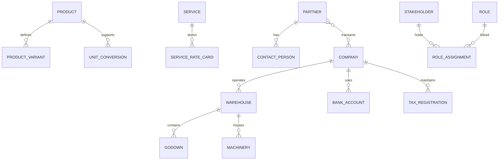
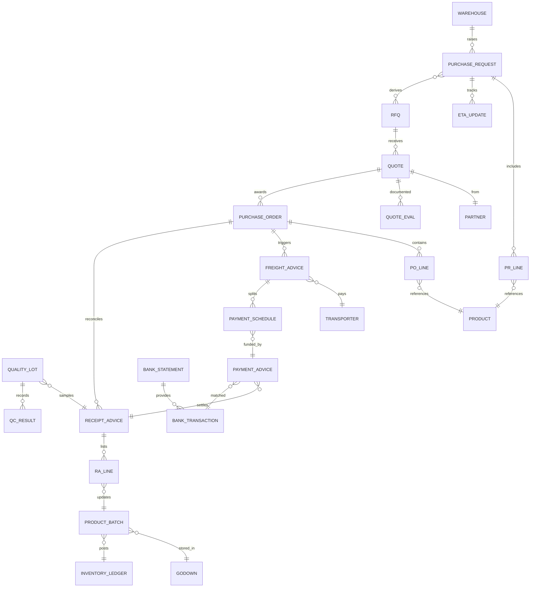
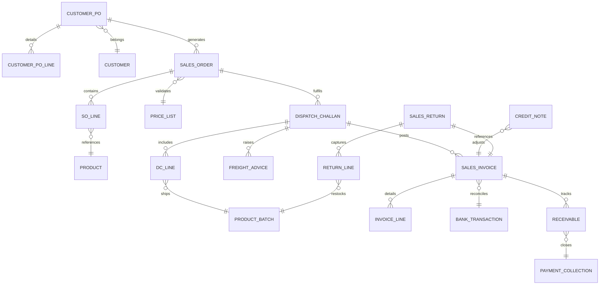
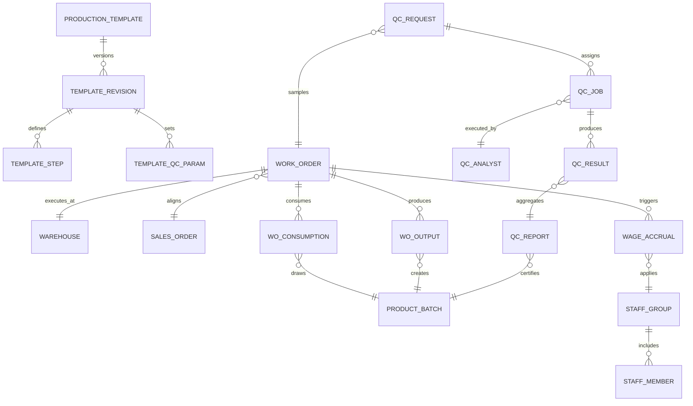
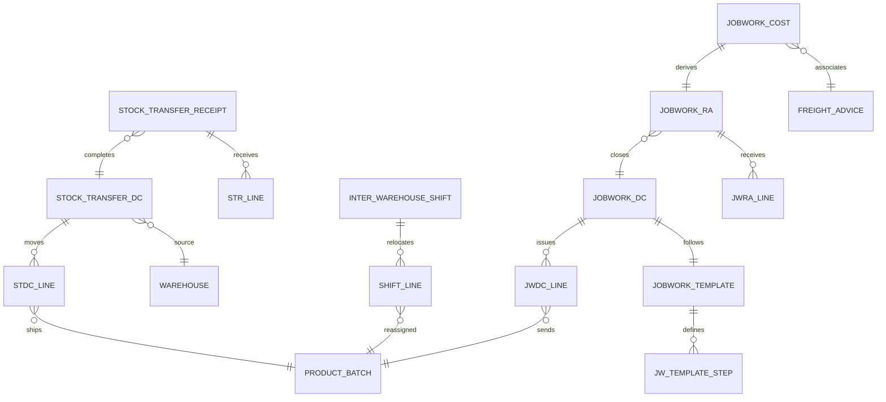
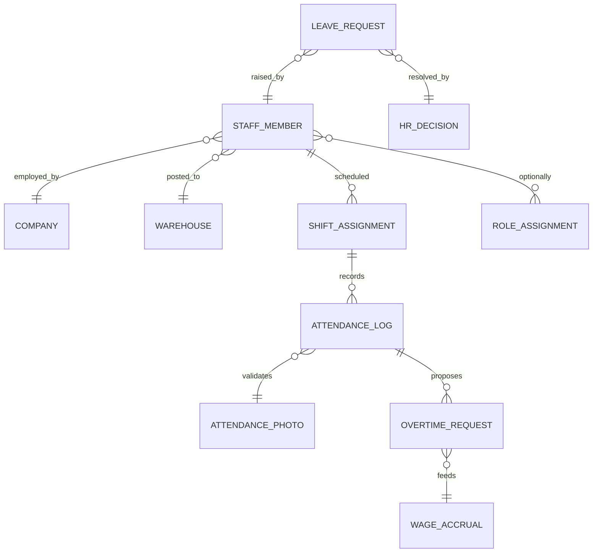

# Cross-Module ER Diagrams

This library focuses on the data connections that span multiple ERP modules, complementing the domain-specific ERDs. Use these diagrams to understand how records interact across purchase, sales, production, QC, logistics, finance, and attendance components.

> **Notation**: Mermaid ER diagrams are oriented with master data on the left and transactional entities on the right. Crow's feet (`||--o{`) denote one-to-many relationships, while double bars (`||`) indicate mandatory participation.

## 1. Master Data Hub

## 2. Purchase ↔ Inventory ↔ Finance

- **PO_LINE** carries `Extra Commission` and `Agent Commission` fields so landed cost flows into receipt advice, inventory valuation, and vendor settlement.
- **FREIGHT_ADVICE** persists shipment quantity, UOM, and destination state for cost-per-unit analytics while remaining a Freight Coordinator → Finance Manager approval flow.

## 3. Sales ↔ Logistics ↔ Finance

- Outbound **FREIGHT_ADVICE** shares the same quantity/UOM/destination metrics, ensuring cost-per-unit reporting by customer geography while Freight Coordinator drafts and Finance Manager approves.

## 4. Production ↔ QC ↔ Wages

- **WAGE_ACCRUAL/WAGE_VOUCHER** records originate with the Warehouse Coordinator (Office) and route to the Finance Manager for approval, keeping wage advice ownership aligned with finance controls.

## 5. Logistics ↔ Stock Transfer ↔ Job Work

- Inter-warehouse freight advice follows the same Freight Coordinator creation and Finance Manager approval, with cost-per-unit and destination state captured for transfer analytics.

## 6. Attendance ↔ HR ↔ Finance

These diagrams should be reviewed whenever new modules are added or relationships evolve, ensuring integration points remain consistent across the ERP landscape.
