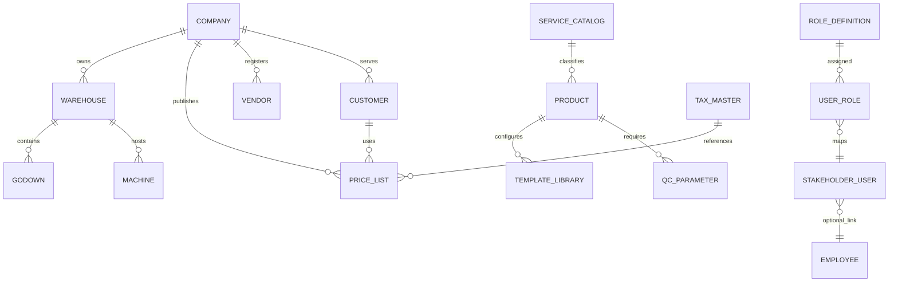
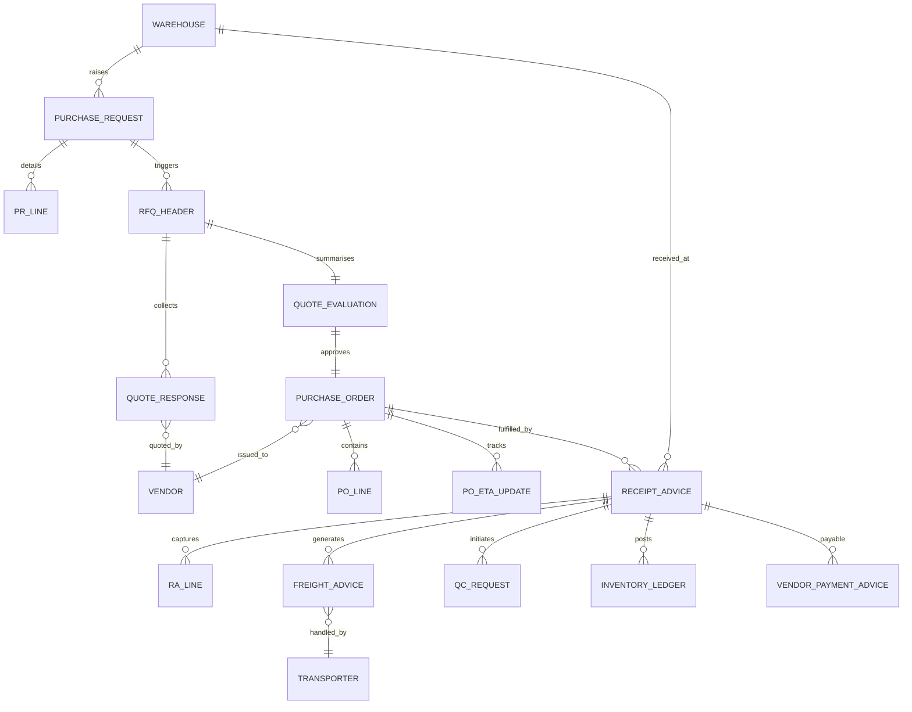
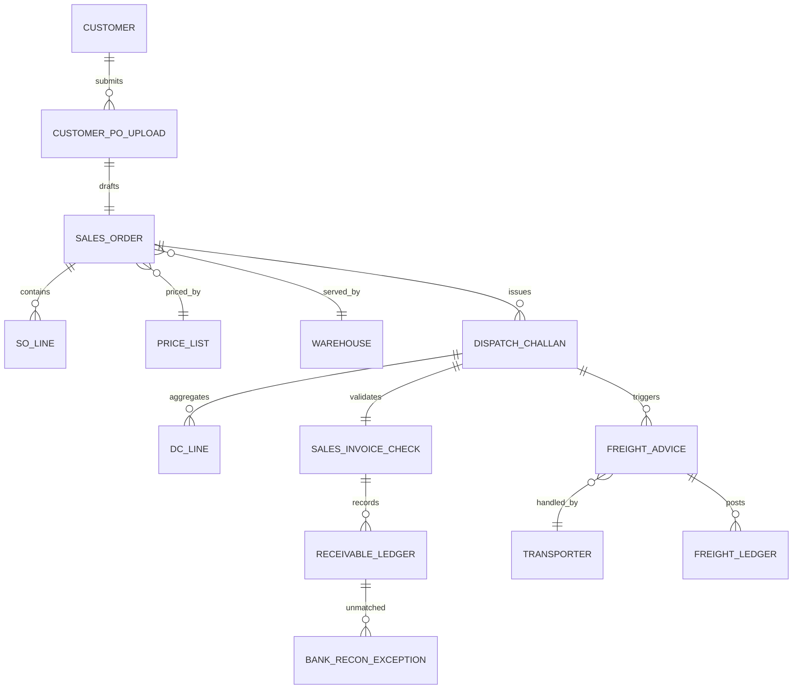
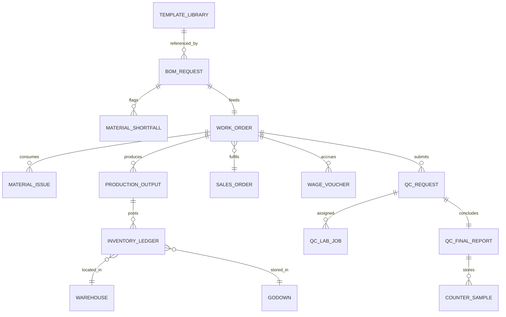
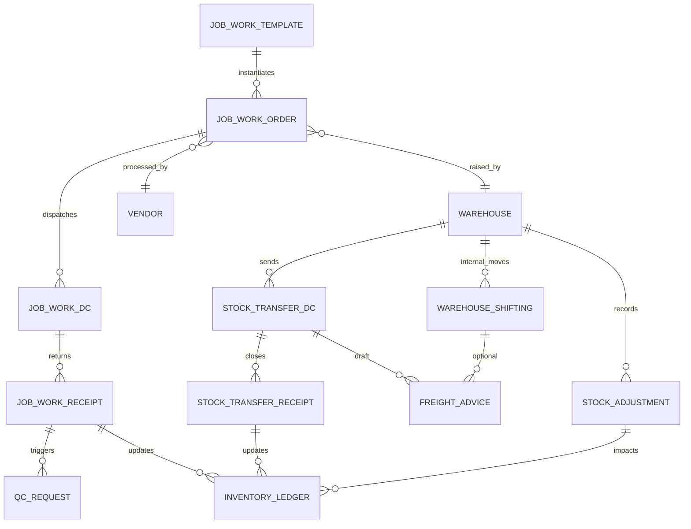
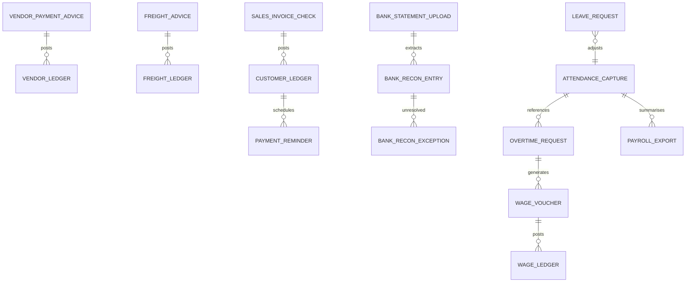

# Zoho Creator ERP ERD Library

These entity-relationship diagrams visualise major data domains. Use them with the data model tables to validate lookups, subforms, and automation logic during implementation.

## 1. Core Masters

## 2. Purchase & Inbound Logistics

- **PO_LINE** holds extra and agent commission attributes so landed cost flows through receipts and finance.
- **FREIGHT_ADVICE** nodes encapsulate shipment quantity/UOM and destination metadata for cost-per-unit analysis while remaining a Freight Coordinator → Finance Manager approval.

## 3. Sales, Dispatch & Outbound Freight

- Outbound FREIGHT_ADVICE inherits the same quantity/UOM/destination capture so per-destination cost KPIs are available for customer shipments with Freight Coordinator initiation and Finance Manager approval.

## 4. Production, Inventory & QC

- WAGE_VOUCHER records originate from the Warehouse Coordinator (Office) and escalate to the Finance Manager for approval, meeting wage governance requirements.

## 5. Job Work, Transfers & Adjustments

- Transfer-related FREIGHT_ADVICE entries mirror the Freight Coordinator → Finance Manager approval path and capture shipment quantity/UOM for per-destination transfer costing.

## 6. Finance & Attendance

Each ERD abstracts Creator forms into conceptual entities; adapt notation as needed for Creator's lookup and subform schema during build.
