# Zoho Creator ERP Module Flowcharts

This document provides module-specific process flowcharts derived from the master blueprint. Each diagram highlights primary forms, decision points, and role hand-offs. Use these visual references while configuring Zoho Creator workflows and approvals.

## Purchase Module
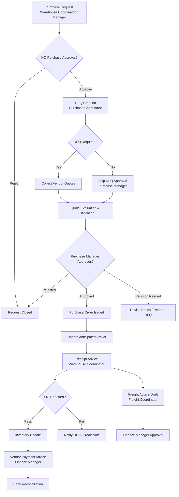

## Sales Module
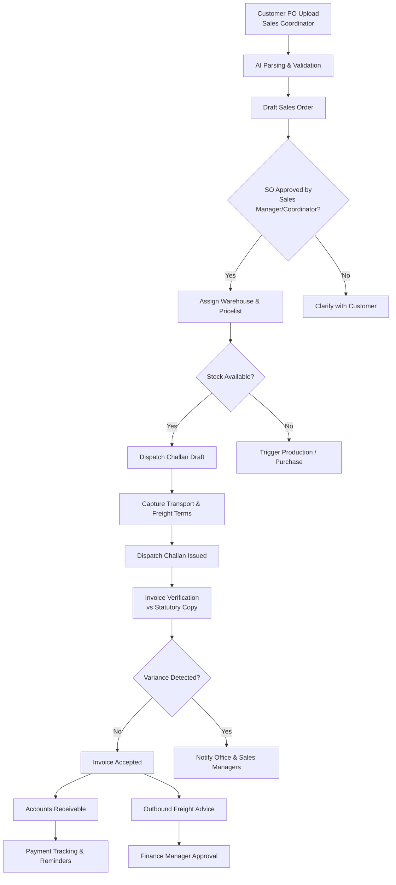

## Production Module
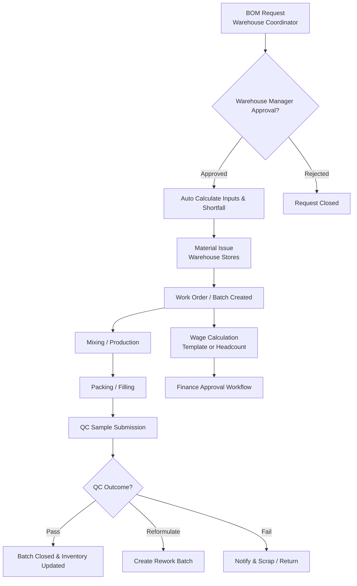

## Quality Control Module
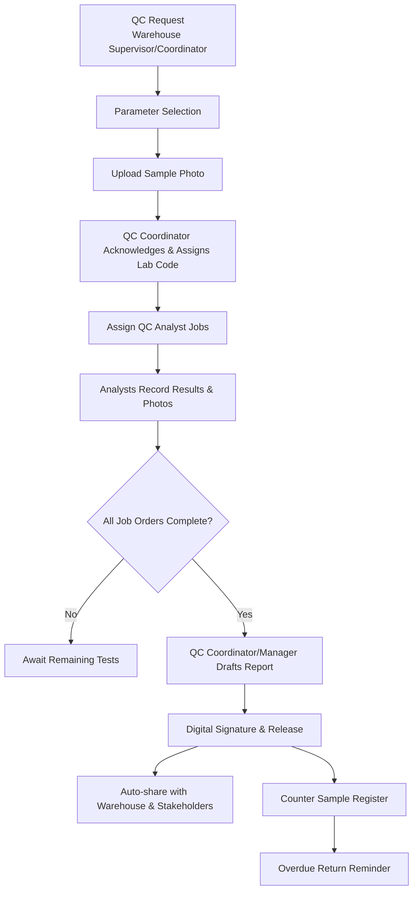

## Inventory & Stock Transfer Module
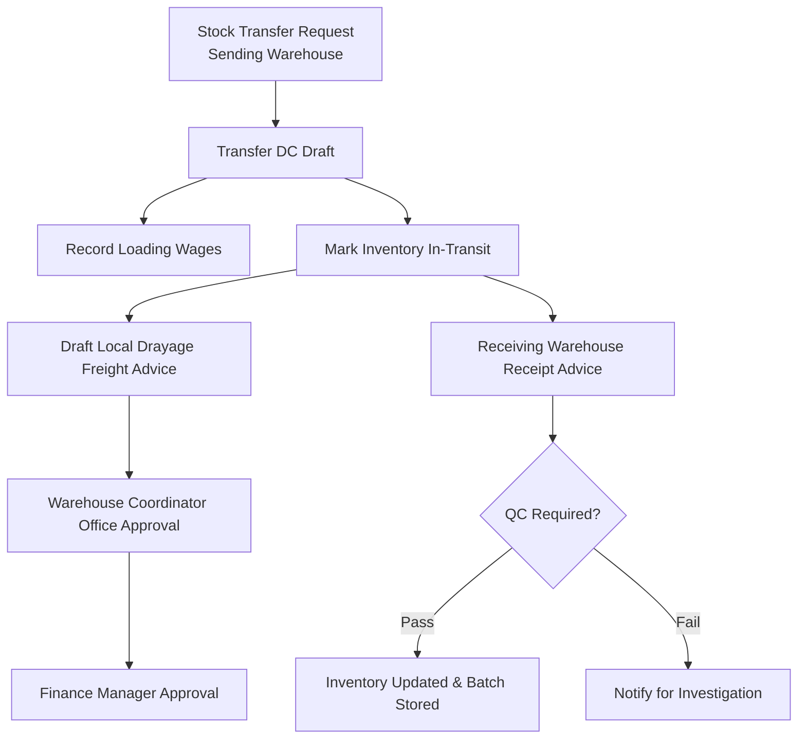

## Finance Module
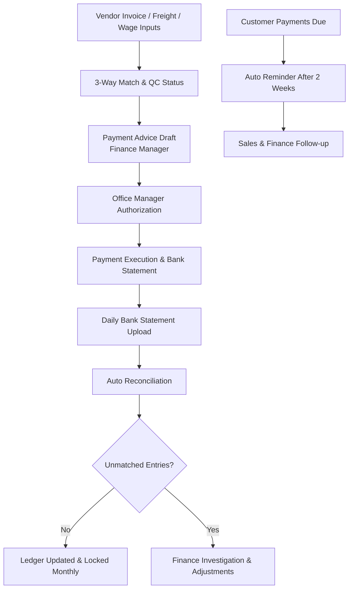

## Logistics & Freight Coordination
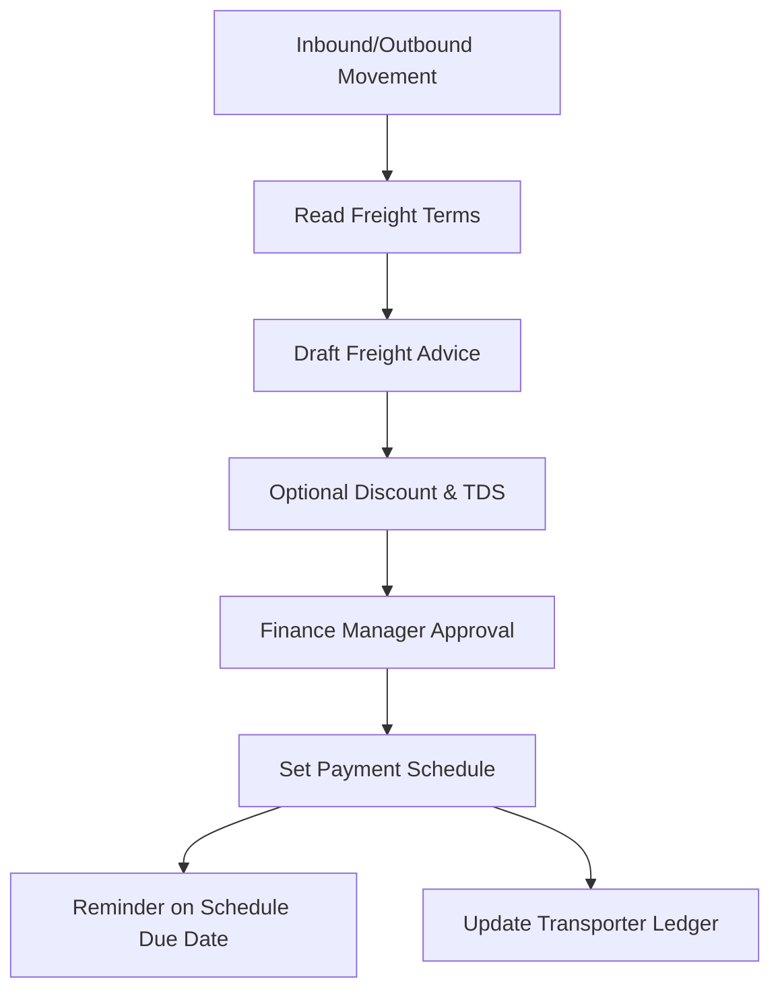

## Job Work Module
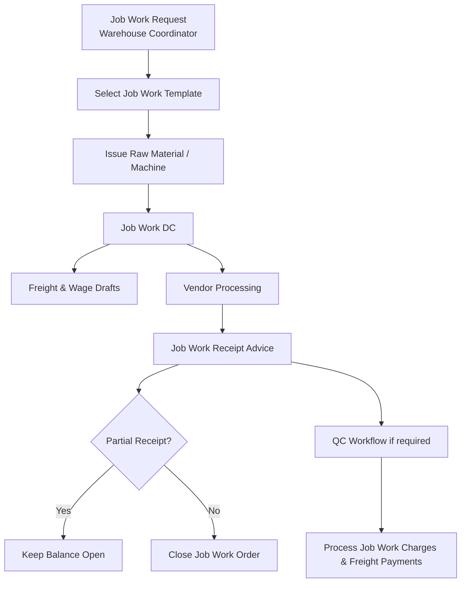

## Sales Return Module
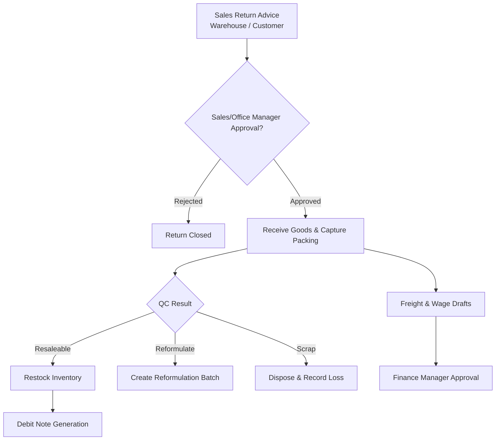

## Stock Adjustment Module
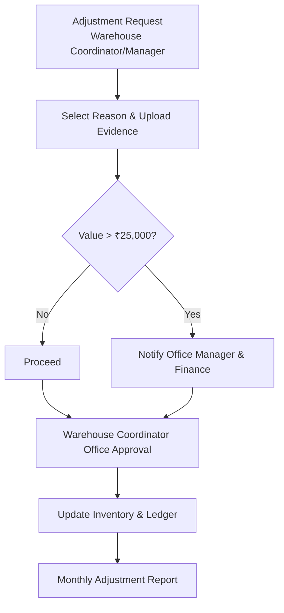

## Attendance & HR Module
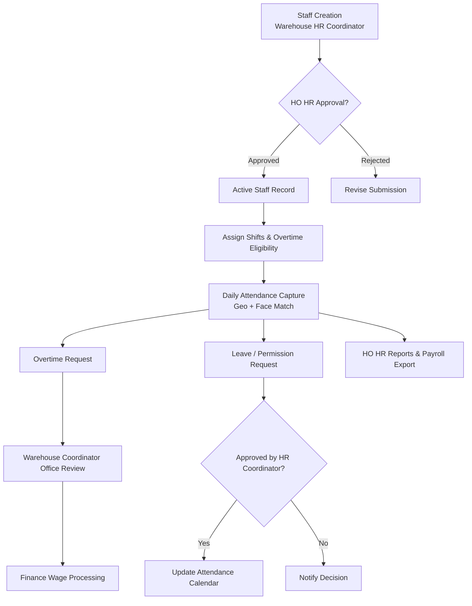
```
